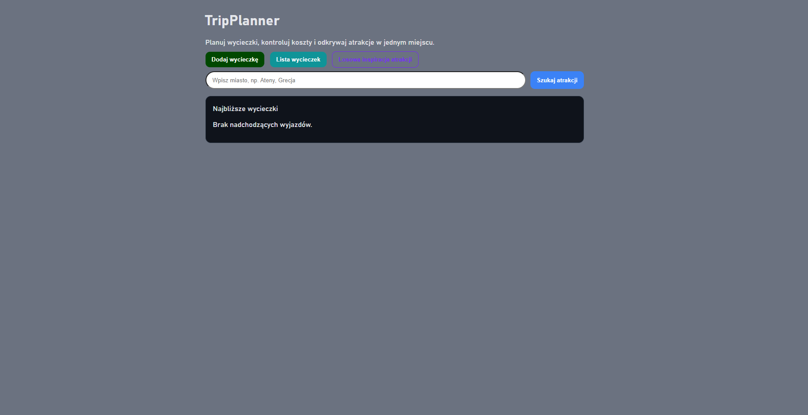
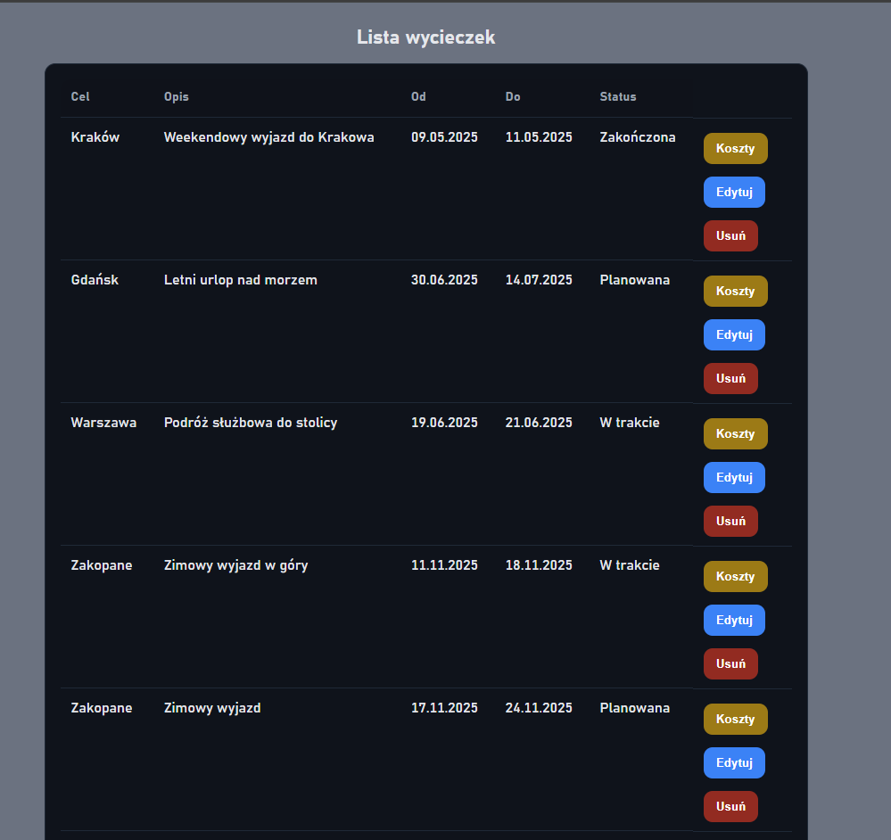

# TripPlanner - F# + Blazor

Functional implementation of a travel planning and expense management system built with F#, Blazor and PostgreSQL.

## Overview

TripPlanner F# is an alternative implementation of the travel management system where the business logic and domain modeling are implemented using functional programming principles.

The application allows users to manage trips, track expenses, organize travel schedules and discover destinations through OpenStreetMap integration.

The project demonstrates how functional programming can be applied to real-world business applications within the .NET ecosystem.

---

## Features

- Trip management
- Expense tracking
- Cost aggregation and reporting
- Travel scheduling
- Trip status management
- OpenStreetMap integration
- Tourist attraction search
- Destination inspiration generator
- PostgreSQL persistence
- Responsive Blazor UI

---

## Functional Concepts

This project focuses on applying functional programming concepts in a business application:

- Immutable domain models
- Records
- Discriminated Unions
- Pattern Matching
- Functional validation
- Functional business workflows
- Separation of domain logic from presentation

---

## Architecture

The application is structured into multiple layers:

### Presentation Layer
- Blazor UI
- Forms and user interaction
- Dashboard and travel management pages

### Domain Layer
- Functional domain models
- Validation rules
- Business workflows

### Infrastructure Layer
- PostgreSQL persistence
- Data access
- OpenStreetMap integration

---

## Technologies

- F#
- ASP.NET Core
- Blazor
- PostgreSQL
- OpenStreetMap
- REST APIs
- Functional Programming

---

## Screenshots

### Dashboard



### Create Trip


### Trips List



### Expense Management


---

## OpenStreetMap Integration

TripPlanner integrates with OpenStreetMap to provide location-based travel planning features.

Capabilities include:

- Destination search
- Tourist attraction discovery
- Travel inspiration suggestions
- Location visualization
- External API integration

---

## What This Project Demonstrates

- Functional programming in .NET
- Domain modeling using F#
- Immutable business objects
- Business application architecture
- PostgreSQL integration
- OpenStreetMap integration
- Full-stack web development with Blazor

---

## Comparison With C# Version

This project was created alongside a C# implementation of TripPlanner to compare different approaches to business application development.

### C# Version
- Object-Oriented Programming
- Entity Framework Core
- Traditional layered architecture

### F# Version
- Functional Programming
- Immutable domain models
- Pattern matching
- Functional business workflows

---

## Running Locally

### Requirements

- .NET 9 SDK
- PostgreSQL

### Restore packages

```bash
dotnet restore
```

### Build

```bash
dotnet build
```

### Run

```bash
dotnet run
```

---

## Author

**Michał Łuczak**

Software Engineer focused on .NET, Software Architecture, Functional Programming and Business Systems.